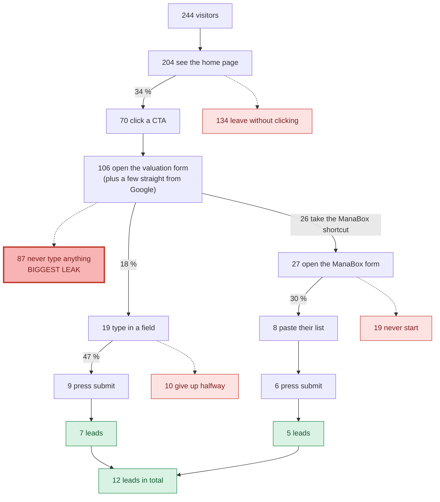

```mermaid
flowchart TD
    V["244 visitors"] --> H["204 see the home page"]
    H -->|"34 %"| C["70 click a CTA"]
    H -.-> LH["134 leave without clicking"]

    C --> F["106 open the valuation form<br/>(plus a few straight from Google)"]
    F -->|"18 %"| S["19 type in a field"]
    F -.-> LF["87 never type anything<br/>BIGGEST LEAK"]
    F -->|"26 take the ManaBox shortcut"| M["27 open the ManaBox form"]

    S -->|"47 %"| E["9 press submit"]
    S -.-> LS["10 give up halfway"]
    E --> L1["7 leads"]

    M -->|"30 %"| MS["8 paste their list"]
    M -.-> LM["19 never start"]
    MS --> ME["6 press submit"]
    ME --> L2["5 leads"]

    L1 --> T["12 leads in total"]
    L2 --> T

    classDef loss fill:#fde2e2,stroke:#c0392b,color:#7b1d1d
    classDef big fill:#f8b4b4,stroke:#c0392b,stroke-width:3px,color:#7b1d1d
    classDef win fill:#d9f2e3,stroke:#1e8449,color:#145a32
    class LH,LS,LM loss
    class LF big
    class L1,L2,T win
```
